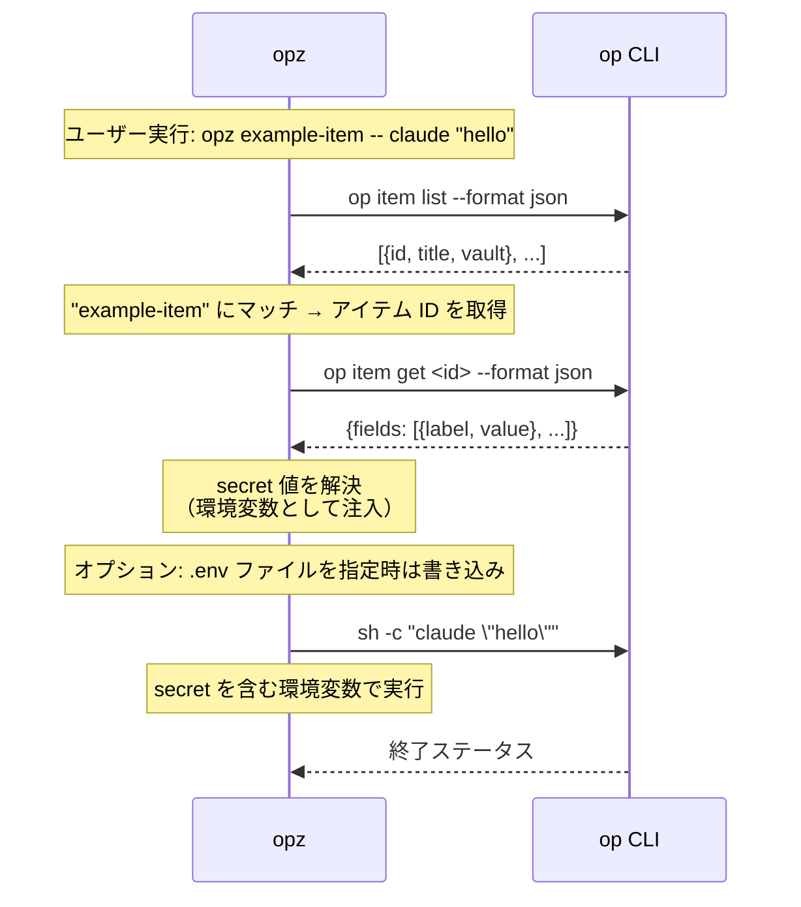

# opz

`opz` は 1Password CLI の小さなラッパーです。アイテムを探し、有効なフィールド名を環境変数に変換し、その secret を入れた状態でコマンドを実行できます。

## 機能

* タイトルのキーワードで 1Password アイテムを検索します。
* `doctor` で `op` の認証状態、任意の依存 CLI、平文の `.env` 系 credential ファイルをチェックします。
* shell の環境変数名として使えるフィールドラベルを表示します。
* 1 つ以上の 1Password アイテムから secret を取得してコマンドを実行します。repository title による item 自動検出にも対応します。
* `op://...` 参照を含む env ファイルを生成し、既存ファイルの無関係な行は残します。
* 既存 script を、明示 item や `.env` から repository title と metadata ベースの管理へ migrate できます。
* private 設定ファイルを Secure Note として保存します。
* 有効なアイテムフィールドを GitHub repository secrets に保存し、item 側の repository metadata があれば誤配を防ぎます。
* 有効なアイテムフィールドを Wrangler 経由で Cloudflare Worker secrets に保存します。
* bundled `opz` Agent Skill を出力します。
* 明示 item lookup と legacy migration path 用に、アイテムリストと repository metadata を 60 秒キャッシュします。

## インストール

```bash
cargo install opz
```

## 使い方

### アイテム検索

タイトルのキーワードで 1Password アイテムを検索します:

```bash
opz find <query>
```

例:
```bash
opz find github
# 出力: <item-id>    <vault-name>    github-token
```

### Doctor

1Password CLI の状態と外部コマンド依存をチェックします:

```bash
opz doctor
```

`doctor` は必須の `op` チェックが失敗した場合だけ非 0 で終了します。`gh`、`wrangler`、`git`、`sh`、`secretlint` など任意ツールの欠落は警告として表示します。平文の `.env` 系 credential ファイルもチェックし、`secretlint` が使える場合はそのファイルに対して実行します。

### アイテムラベル表示

環境変数名として使えるフィールドラベルを表示します:

```bash
opz show [OPTIONS] [--with-item] <ITEM>...
```

オプション:
* `--vault <NAME>` - Vault 名（省略時はすべての Vault を検索）
* `--with-item` - アイテムごとの見出しを表示

例:
```bash
# ラベル名のみ（1行1ラベル）
opz show foo bar

# アイテム見出し付きで表示
opz show --with-item foo bar
```

### Agent Skill を出力

`opz` 用の bundled Agent Skills `SKILL.md` を出力します:

```bash
opz skills
```

これにより、他の agent や tool は Agent Skills 標準形式で `opz` の利用コンテキストをそのまま読み込めます。

### 削除済みの `create` コマンド

`opz create` は item を作成しません。古い script が unknown command で失敗しないよう、隠し互換コマンドとして残し、移行先を示すエラーを返します。

代わりに次を使います:

```bash
# .env から API_CREDENTIAL item を作成し、対応 script を migrate
opz migrate --new

# .env 以外の private file を Secure Note item として保存
opz note app.conf
```

### Secret 付きでコマンド実行

1 つ以上の 1Password アイテムから secret を取得してコマンドを実行します:

```bash
opz run [OPTIONS] [--env-file <ENV>] [<ITEM>...] -- <COMMAND>...
opz [OPTIONS] [--env-file <ENV>] [<ITEM>...] -- <COMMAND>...
```

オプション:
* `--vault <NAME>` - Vault 名（省略時はすべての Vault を検索）
* `--env-file <ENV>` - 出力 env ファイルパス。省略時はファイルを書きません。

引数:
* `<ITEM>...` - secret を取得する任意のアイテムタイトル。省略時は、現在の git remote repository 名（例: `owner/repo`）と完全一致する title の item を 1 件だけ自動検出します。

`--env-file` を指定すると、env ファイルはコマンド終了後も残ります。既存ファイルはマージされ、無関係な行は残り、重複キーは上書きされ、新しいキーは末尾に追加されます。複数アイテムで同じキーがある場合は後勝ちです（`opz run foo bar ...` では `bar` の値が優先）。

例:
```bash
# .env ファイルを生成せずに1アイテムで実行
opz run example-item -- your-command

# git remote title から item を自動検出
opz run -- your-command

# 複数アイテムで実行（重複キーは後勝ち）
opz run foo bar -- your-command

# 他の tool が op:// 参照ファイルを必要とするときだけ env ファイルを生成
opz run --env-file .env foo bar -- your-command

# 短縮形でも複数アイテム対応
opz --env-file .env.local foo bar -- your-command

# shell ではなく opz に展開させるため、変数を quote する
opz run my-service -- curl -H 'Authorization: Bearer $API_TOKEN' https://api.example.test

# Vault を指定
opz run --vault Private foo bar -- your-command
```

### Env ファイル生成

コマンドを実行せず、`op://...` の env 参照を生成します:

```bash
opz gen [OPTIONS] [--env-file <ENV>] <ITEM>...
```

例:
```bash
# セクション付きで標準出力
opz gen foo bar

# .env ファイルを生成
opz gen --env-file .env foo bar

# カスタムパスに生成
opz gen --env-file .env.production foo bar

# Vault を指定
opz --vault Private gen foo bar
```

標準出力では `# --- item: <title> ---` のようなコメント見出しを付けます。ファイル出力では、セクションコメントなしのマージ済みキー一覧を書きます。

### Script と `.env` の migrate

`justfile` / `Justfile` の recipe と `package.json` の scripts を、repository item title と metadata へ移行します:

```bash
opz migrate [OPTIONS]
```

オプション:
* `--dry-run` - 1Password item やファイルを編集せず、変更内容だけを表示
* `--new` - `.env` から新しい `API_CREDENTIAL` item を作成してから `.env` ベースの script を書き換えます。item 名は先頭の git remote repository 名です。
* `--restore` - itemless な `opz run --` に移行済みの script を、明示 item 付きの呼び出しに戻します。
* `--vault <NAME>` - Vault 名（省略時はすべての Vault を検索）

挙動:
* `opz run <ITEM> -- <COMMAND>` と `opz <ITEM> -- <COMMAND>` は、デフォルトでは明示 item のまま残します。`migrate` は repository metadata を記録し、item と repository がそれぞれ 1 件だけなら item title と対応する Just item 変数を `owner/repo` に揃えます。
* `opz migrate --restore` は、itemless な `opz run -- <COMMAND>` を、Just recipe parameter または現在の repository title から推定した `opz run <ITEM> -- <COMMAND>` に戻します。
* `op item get <ITEM>` は metadata 登録の手がかりとして使いますが、`opz run` と等価ではないため書き換えません。
* `.env` ベースの script は `--new` 指定時だけ書き換えます。指定がない場合は報告してスキップします。
* `--dry-run` は item 詳細を取得せず、追加される repository metadata を表示します。
* `package.json` は該当する script 文字列だけを置き換えるため、それ以外の key 順や整形は維持します。

例:
```bash
# 変更内容だけ確認
opz migrate --dry-run

# script を書き換え、item metadata を更新
opz migrate

# .env から新しい item を作成して migrate
opz migrate --new

# itemless auto-detection に移行済みの script を戻す
opz migrate --restore
```

### Private 設定ファイルを Secure Note として保存

private 設定ファイルを git remote 由来のタイトルで Secure Note item として保存します:

```bash
opz note <FILE>
```

挙動:
* 本文は ```` ```<file name>\n<content>\n``` ```` の形で保存します。
* タイトルには git remote URL から抽出した `org/repo` を使います。
* remote が複数ある場合は remote ごとに作成し、同名時は `-2`, `-3` のように番号を付けます。
* 解釈できる git remote がない場合はエラー終了します。

例:
```bash
opz note app.conf
opz --vault Private note app.conf
```

### 既存 item に GitHub Repository Metadata を追加

既存の 1Password item に `github_repositories` metadata を追加または更新します:

```bash
opz github-repo [OPTIONS] <ITEM>...
```

オプション:
* `--repo <OWNER/REPO>` - 記録する repository。複数回指定できます。省略時は現在の repository の git remote から解釈できる値を使います。
* `--dry-run` - item を編集せず、更新内容だけを表示
* `--vault <NAME>` - Vault 名（省略時はすべての Vault を検索）

例:
```bash
# 現在の git remote を使った migration を事前確認
opz github-repo --dry-run my-service shared-secrets

# 現在の git remote repository metadata を追加
opz github-repo my-service shared-secrets

# 明示した repository を追加
opz github-repo --repo owner/repo --repo other/service my-service
```

既存の `github_repositories` は残し、指定した repository とマージします。

### GitHub Repository Secrets に保存

有効なアイテムフィールドを GitHub repository secrets に保存します:

```bash
opz github-secret [OPTIONS] <ITEM>...
```

オプション:
* `--repo <OWNER/REPO>` - 保存先 GitHub repository（省略時は現在の `gh` repository）
* `--dry-run` - 値を書き込まず、保存対象の secret 名だけを表示
* `--vault <NAME>` - Vault 名（省略時はすべての Vault を検索）

例:
```bash
# secret 名を事前確認
opz github-secret --dry-run my-service

# 現在の repository に保存
opz github-secret my-service

# repository を指定して保存
opz github-secret --repo owner/repo my-service shared-secrets
```

`github-secret` は `gen` や `run` と同じ有効フィールドラベルを使います。複数 item で同名がある場合は後勝ちです。Secret 値はメモリ上で解決し、`gh secret set` の stdin に渡します。値を表示したりコマンド引数に載せたりしません。GitHub が予約しているため、`GITHUB_` で始まる名前は拒否します。

選択した 1Password item に `github_repositories` フィールドがある場合、保存先 repository はその `owner/repo` 一覧のいずれかと一致する必要があります。一覧は改行またはカンマ区切りで複数指定できます。この metadata がない item は従来通り利用できますが、repository guard を適用できないため警告を表示します。

### Cloudflare Worker Secrets に保存

有効なアイテムフィールドを Wrangler 経由で Cloudflare Worker secrets に保存します:

```bash
opz cloudflare-secret [OPTIONS] <ITEM>...
```

オプション:
* `--name <WORKER>` - `wrangler secret bulk --name` に渡す Worker 名
* `--env <ENV>` - `wrangler secret bulk --env` に渡す Wrangler environment
* `--config <PATH>` - `wrangler secret bulk --config` に渡す Wrangler config path
* `--dry-run` - 値を書き込まず、保存対象の secret 名だけを表示
* `--vault <NAME>` - Vault 名（省略時はすべての Vault を検索）

例:
```bash
# secret 名を事前確認
opz cloudflare-secret --dry-run my-service

# 現在の Wrangler project config を使って保存
opz cloudflare-secret my-service

# Worker と environment を指定して保存
opz cloudflare-secret --name worker-app --env production my-service shared-secrets
```

`cloudflare-secret` は `gen` や `run` と同じ有効フィールドラベルを使います。複数 item で同名がある場合は後勝ちです。Secret 値はメモリ上で解決し、JSON として `wrangler secret bulk` の stdin に渡します。値を表示したりコマンド引数に載せたりしません。

## 仕組み

1. item title が指定されている場合、1Password から item list を取得し、その metadata を 60 秒キャッシュします。
2. title lookup はまず完全一致、見つからなければタイトルの部分一致を使います。
3. item title が省略されている場合、git remote を読み、`owner/repo` のような item title を直接 lookup します。legacy の `github_repositories` scan は `OPZ_AUTODETECT_LEGACY_SCAN=1` の場合だけ使います。
4. item が決まると、その item を取得し、有効な env ラベルを持つフィールドから `op://<vault_id>/<item_id>/<field>` 参照を作ります。
5. `--env-file` 指定があれば、参照をファイルに書き込み、既存ファイルの無関係な行は残します。通常は file-free な `opz run` を使い、env ファイルは `op://` 参照を必要とする tool 向けです。
6. `op run --env-file <temp> -- sh -c 'env -0'` で secret をまとめて解決し、失敗した場合は参照ごとに `op read` へフォールバックします。
7. 解決済みの値を環境変数に入れてコマンドを実行します。コマンド引数内の `$VAR` と `${VAR}` は、選択した item から解決できた変数だけ展開します。

`gen` は参照を書いたところで終了します。`show` は secret 値を解決せず、有効なラベルだけを表示します。

secret 解決用の `op` 呼び出しはデフォルトで 30 秒 timeout します。遅い 1Password CLI 操作を許可するには `OPZ_OP_TIMEOUT_SECONDS=<秒>` を設定してください。

## `op` コマンドの利用

セキュリティの透明性のため、`opz` が `op` CLI をどのように利用するかを示します:



セキュリティ: `opz` は secret へのアクセスと認証を `op` CLI に任せます。60 秒キャッシュするのは item list と repository metadata だけで、secret 値は保存しません。

## 要件

[1Password CLI](https://developer.1password.com/docs/cli/) (`op`) をインストールし、認証してから secret-backed command を使います。

`github-secret` には GitHub CLI (`gh`) が必要です。`cloudflare-secret` には Wrangler (`wrangler`) が必要です。`migrate` と `note` は repository remote を読むために Git (`git`) を使います。

## E2Eテスト

実際の1Passwordを使うe2eテストは `tests/e2e_real_op.rs` にあります。

安全のため、`OPZ_E2E=1` を指定した場合にのみ実行されます:

```bash
OPZ_E2E=1 cargo test --test e2e_real_op -- --nocapture
```

または `just` で実行できます:

```bash
just e2e
```
