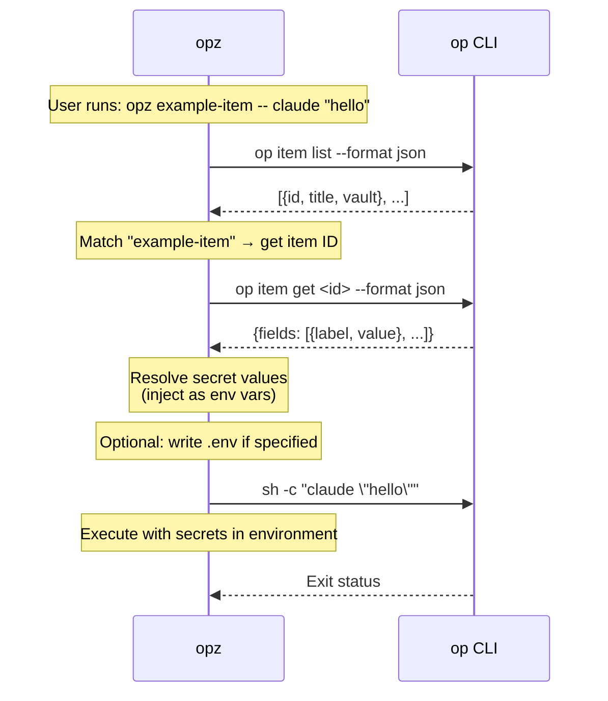

# opz
<!-- bdg:begin -->
[](https://crates.io/crates/opz)
[](https://github.com/f4ah6o/opz)
[](https://github.com/f4ah6o/opz/actions/workflows/publish.yaml)
<!-- bdg:end -->

`opz` is a small wrapper around the 1Password CLI. It finds items, turns valid field labels into environment variables, and can run a command with those secrets injected.

## Features

* Search 1Password items by title keyword.
* Check `op` authentication and optional CLI dependencies with `doctor`.
* Show item field labels that are valid shell environment variable names.
* Run a command with secrets from one or more 1Password items.
* Generate env files containing `op://...` references, preserving unrelated existing lines.
* Create 1Password items from `.env` files or save private config files as Secure Notes.
* Store valid item fields as GitHub repository secrets.
* Store valid item fields as Cloudflare Worker secrets through Wrangler.
* Print the bundled `opz` Agent Skill.
* Cache item lists for 60 seconds and fall back to title contains matching when exact lookup misses.

## Installation

```bash
cargo install opz
```

## Trusted publishing

This repository is configured for [crates.io trusted publishing](https://crates.io/docs/trusted-publishing).
Create a tag such as `v2026.5.1` and push it to trigger the `Publish to crates.io` workflow, which mints a short-lived token through OIDC and runs `cargo publish --locked`.
Enable trusted publishing for the `opz` crate in the crates.io UI before the workflow requests tokens. The linked repository should be `f4ah6o/opz`.

## Usage

### Find Items

Search item titles by keyword:

```bash
opz find <query>
```

Example:
```bash
opz find github
# Output: <item-id>    <vault-name>    github-token
```

### Doctor

Check 1Password CLI status and external command dependencies:

```bash
opz doctor
```

`doctor` exits non-zero when required `op` checks fail. Missing optional tools such as `gh`, `wrangler`, `git`, or `sh` are reported as warnings.

### Show Item Labels

Show field labels that can be used as environment variable names:

```bash
opz show [OPTIONS] [--with-item] <ITEM>...
```

Options:
* `--vault <NAME>` - Vault name (optional, searches all vaults if omitted)
* `--with-item` - Show per-item headers

Examples:
```bash
# Label names only (one per line)
opz show foo bar

# Include item header sections
opz show --with-item foo bar
```

### Emit Agent Skill

Print the bundled Agent Skills `SKILL.md` for `opz`:

```bash
opz skills
```

This lets other agents and tools load the current `opz` usage context directly in the Agent Skills standard format.

### Run Commands with Secrets

Run a command with secrets from one or more 1Password items:

```bash
opz run [OPTIONS] [--env-file <ENV>] <ITEM>... -- <COMMAND>...
opz [OPTIONS] [--env-file <ENV>] <ITEM>... -- <COMMAND>...
```

Options:
* `--vault <NAME>` - Vault name (optional, searches all vaults if omitted)
* `--env-file <ENV>` - Output env file path. If omitted, no file is written.

Arguments:
* `<ITEM>...` - One or more item titles to fetch secrets from.

When `--env-file` is set, the file remains after the command exits. Existing files are merged: unrelated lines stay in place, duplicate keys are overwritten, and new keys are appended. If multiple items define the same key, later items win (`opz run foo bar ...` prefers values from `bar`).

Examples:
```bash
# Run command with one item (no .env file generated)
opz run example-item -- your-command

# Run command with multiple items (later items win on duplicate keys)
opz run foo bar -- your-command

# Run with secrets and generate .env file
opz run --env-file .env foo bar -- your-command

# Top-level shorthand also supports multiple items
opz --env-file .env.local foo bar -- your-command

# Quote variables so your shell leaves them for opz to expand
opz run my-service -- curl -H 'Authorization: Bearer $API_TOKEN' https://api.example.test

# Specify vault
opz run --vault Private foo bar -- your-command
```

### Generate Env File

Generate `op://...` env references without running a command:

```bash
opz gen [OPTIONS] [--env-file <ENV>] <ITEM>...
```

Examples:
```bash
# Output sectioned env references to stdout
opz gen foo bar

# Generate .env file
opz gen --env-file .env foo bar

# Generate to custom path
opz gen --env-file .env.production foo bar

# Specify vault
opz --vault Private gen foo bar
```

Stdout uses per-item comment headers such as `# --- item: <title> ---`. File output writes the merged key list without those section comments.

### Create Item from `.env` or Private Config

`create` has two modes, selected by the source file name:

```bash
opz [OPTIONS] create <ITEM> [ENV]
```

Arguments:
* `<ITEM>` - New item title when `[ENV]` is exactly `.env`.
* `[ENV]` - Source file path. The default is `.env`.

Behavior:
* If `[ENV]` is exactly `.env`:
  * Creates an `API_CREDENTIAL` item.
  * Uses `<ITEM>` as the title.
  * Adds each `KEY=VALUE` as a custom text field named `KEY`.
  * Supports `export KEY=...`, inline comments (`KEY=value # note`), and `#` inside quotes.
  * Skips invalid env keys and existing `op://...` values.
  * For duplicate keys, the last entry wins.
* If `[ENV]` is anything other than `.env`:
  * Creates `SECURE_NOTE` item(s).
  * Stores the file as a fenced note body: ```` ```<file name>\n<content>\n``` ````.
  * Uses git remote repository names (`org/repo`) as item titles.
  * If multiple remotes exist, creates one item per remote; duplicate titles get `-2`, `-3`, and so on.
  * Fails if no parseable git remote is available.

Examples:
```bash
# Create item from .env
opz create my-service

# Save private config as Secure Note (title from git remote org/repo)
opz create ignored-item app.conf

# Create item in specific vault
opz --vault Private create my-service .env
```

### Store GitHub Repository Secrets

Store valid item fields as GitHub repository secrets:

```bash
opz github-secret [OPTIONS] <ITEM>...
```

Options:
* `--repo <OWNER/REPO>` - Target GitHub repository (defaults to the current `gh` repository)
* `--dry-run` - Print the secret names that would be set without writing values
* `--vault <NAME>` - Vault name (optional, searches all vaults if omitted)

Examples:
```bash
# Preview secret names
opz github-secret --dry-run my-service

# Store secrets in the current repository
opz github-secret my-service

# Store secrets in a specific repository
opz github-secret --repo owner/repo my-service shared-secrets
```

`github-secret` uses the same valid field labels as `gen` and `run`. Duplicate names across multiple items use the later item. Secret values are resolved in memory and passed to `gh secret set` through stdin; values are not printed or passed as command arguments. Names starting with `GITHUB_` are rejected because GitHub reserves that prefix.

### Store Cloudflare Worker Secrets

Store valid item fields as Cloudflare Worker secrets through Wrangler:

```bash
opz cloudflare-secret [OPTIONS] <ITEM>...
```

Options:
* `--name <WORKER>` - Worker name passed to `wrangler secret bulk --name`
* `--env <ENV>` - Wrangler environment passed to `wrangler secret bulk --env`
* `--config <PATH>` - Wrangler config path passed to `wrangler secret bulk --config`
* `--dry-run` - Print the secret names that would be set without writing values
* `--vault <NAME>` - Vault name (optional, searches all vaults if omitted)

Examples:
```bash
# Preview secret names
opz cloudflare-secret --dry-run my-service

# Store secrets using the current Wrangler project config
opz cloudflare-secret my-service

# Store secrets for a specific Worker environment
opz cloudflare-secret --name worker-app --env production my-service shared-secrets
```

`cloudflare-secret` uses the same valid field labels as `gen` and `run`. Duplicate names across multiple items use the later item. Secret values are resolved in memory and passed to `wrangler secret bulk` through stdin as JSON; values are not printed or passed as command arguments.

## How It Works

1. Fetches the item list from 1Password and caches that metadata for 60 seconds.
2. Finds one matching title. Exact match is tried first; title contains matching is used as a fallback.
3. Fetches the matched item and builds `op://<vault_id>/<item_id>/<field>` references for fields with valid env labels.
4. Writes an env file when requested, merging with any existing file.
5. Resolves secrets with `op run --env-file <temp> -- sh -c 'env -0'`, falling back to `op read` per reference if batch resolution fails.
6. Runs the command with resolved values in the environment. `$VAR` and `${VAR}` in command arguments are expanded only for variables resolved from the selected items.

`gen` stops after writing references. `show` fetches items and prints valid labels without resolving secret values.

## `op` Command Usage

For security transparency, here's how `opz` uses the `op` CLI:



Security: `opz` delegates secret access and authentication to the `op` CLI. The 60-second cache stores item-list metadata only, not secret values.

## Tracing (OpenTelemetry + Jaeger)

`opz` can emit OTLP traces, but it is disabled by default. If `OTEL_EXPORTER_OTLP_ENDPOINT` is not set, tracing is a no-op.

### Local setup

```bash
just jaeger-up
just trace-run item=<your-item-title>
just trace-ui
```

### E2E trace on Jaeger

If you want to inspect traces generated by `tests/e2e_real_op.rs`:

```bash
just jaeger-up
just e2e-trace
just trace-ui
```

In Jaeger Search, select service `opz-e2e`.  
`just e2e-trace` automatically sets `OPZ_GIT_COMMIT=$(git rev-parse --short=12 HEAD)`.

### Compare traces by ref or version

Generate traces on each target commit/tag (or release version), then compare:

```bash
just trace-report <ref-or-version>
just trace-compare <base-ref-or-version> <head-ref-or-version>
```

`<ref-or-version>` accepts commit hash, git tag (for example `v2026.5.1`), or `service.version` (for example `2026.5.1`).
Both commands print markdown tables (duration and top child span) for easy copy into PRs.

For less noisy comparisons, aggregate multiple runs and ignore failed traces:

```bash
just trace-report-samples <ref-or-version> samples=5 status=ok
just trace-compare-samples <base-ref-or-version> <head-ref-or-version> samples=5 status=ok
```

`samples` uses latest N traces per operation and reports median/average.
`status` can be `all`, `ok`, or `error`.

Then open Jaeger Search and select service `opz` (or your `OTEL_SERVICE_NAME`) to inspect spans such as:

* `cli.<command>` (root)
* `parse_args`
* `load_config`
* `load_inputs`
* `main_operation`
* `write_outputs`

### Environment variables

* `OTEL_EXPORTER_OTLP_ENDPOINT` - Enables OTLP export when set (example: `http://localhost:4317`)
* `OTEL_SERVICE_NAME` - Optional service name override (default: `opz`)
* `OTEL_TRACES_SAMPLER` - Optional sampler setting (`always_on`, `traceidratio`, etc.)
* `OTEL_TRACES_SAMPLER_ARG` - Optional sampler parameter (for ratio-based samplers)
* `OPZ_TRACE_CAPTURE_ARGS` - `1` to include sanitized `cli.args` in trace attributes (default: disabled)
* `OPZ_GIT_COMMIT` - Optional override for trace resource attribute `git.commit` (default: `git rev-parse --short=12 HEAD`)

## Requirements

* [1Password CLI](https://developer.1password.com/docs/cli/) (`op`) installed and authenticated
* Optional: GitHub CLI (`gh`) for `github-secret`
* Optional: Wrangler (`wrangler`) for `cloudflare-secret`
* Optional: Git (`git`) for private config `create`

## E2E Test

Real 1Password e2e test is available in `tests/e2e_real_op.rs`.

It is gated for safety and runs only when `OPZ_E2E=1` is set:

```bash
OPZ_E2E=1 cargo test --test e2e_real_op -- --nocapture
```

Or use just:

```bash
just e2e
```
