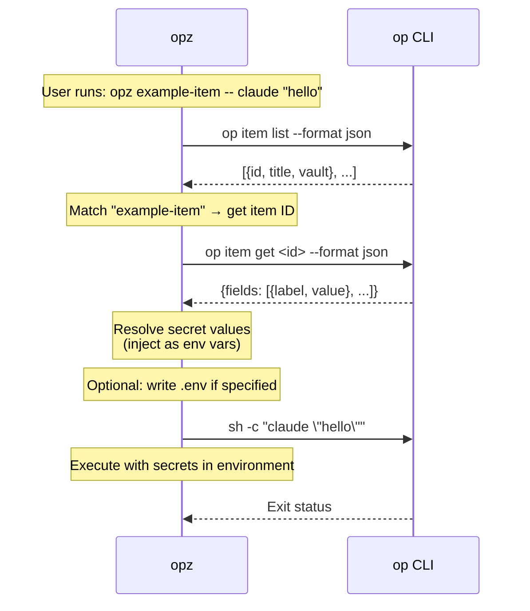

# opz
<!-- bdg:begin -->
[](https://crates.io/crates/opz)
[](https://github.com/f4ah6o/opz)
[](https://github.com/f4ah6o/opz/actions/workflows/publish.yaml)
<!-- bdg:end -->

`opz` is a small wrapper around the 1Password CLI. It finds items, turns valid field labels into environment variables, and runs commands with those secrets injected.

## Features

* Search 1Password items by title keyword.
* Check `op` authentication, optional CLI dependencies, and plaintext `.env`-style credential files with `doctor`.
* Show item field labels that are valid shell environment variable names.
* Manage 1Password Developer Environments through the 1Password MCP server without printing secret values.
* Run a command with secrets from one or more 1Password items, with repository-title auto-detection.
* Delegate command execution to native 1Password Environments with `--environment` when your `op` CLI supports it.
* Generate env files containing `op://...` references, preserving unrelated existing lines.
* Migrate scripts from explicit items or `.env` files to repository metadata.
* Save private config files as Secure Notes.
* Store valid item fields as GitHub repository secrets, guarded by item repository metadata when present.
* Store valid item fields as Cloudflare Worker secrets through Wrangler.
* Print the bundled `opz` Agent Skill.
* Cache item lists and repository metadata for fuzzy lookup and legacy migration paths.

## Installation

```bash
cargo install opz
```

## Usage

### Find Items

Search item titles by keyword:

```bash
opz find <query>
```

Example:
```bash
opz find github
# Output: <item-id>    <vault-name>    github-token
```

### Doctor

Check 1Password CLI status and external command dependencies:

```bash
opz doctor
```

`doctor` exits non-zero when required `op` checks fail. Missing optional tools such as the 1Password MCP server, `gh`, `wrangler`, `git`, `sh`, or `secretlint` are reported as warnings. It also checks for plaintext `.env`-style credential files and, when `secretlint` is available, runs it against those files.

### Show Item Labels

Show field labels that can be used as environment variable names:

```bash
opz show [OPTIONS] [--with-item] <ITEM>...
```

Options:
* `--vault <NAME>` - Vault name (optional, searches all vaults if omitted)
* `--with-item` - Show per-item headers

Examples:
```bash
# Label names only (one per line)
opz show foo bar

# Include item header sections
opz show --with-item foo bar
```

### Emit Agent Skill

Print the bundled Agent Skills `SKILL.md` for `opz`:

```bash
opz skills
```

This lets other agents and tools load the current `opz` usage context directly in the Agent Skills standard format.

### Manage 1Password Environments

Use the 1Password MCP server to create, rename, inspect, and mount Developer Environments. If `--account <ACCOUNT_ID>` is omitted, `opz` authenticates through the 1Password app via MCP.

```bash
opz environment list
opz environment create dev
opz environment rename dev staging
opz environment variables dev
opz environment mount dev .env.local
opz environment mounts dev

# Short alias
opz env list
```

`opz environment variables` prints variable names only. `opz environment mount` asks the MCP server to create a synced local `.env` mount; `opz` does not write secret values itself. Set `OPZ_1PASSWORD_MCP_COMMAND` if the MCP server executable is not named `onepassword-mcp`.

### Removed `create` Command

`opz create` no longer creates items. It remains as a hidden compatibility shim so older scripts get a clear migration error instead of an unknown-command failure.

Use these commands instead:

```bash
# Create an API_CREDENTIAL item from .env and migrate supported scripts
opz migrate --new

# Store a non-.env private file as Secure Note item(s)
opz note app.conf
```

### Run Commands with Secrets

Run a command with secrets from one or more 1Password items:

```bash
opz run [OPTIONS] [--env-file <ENV>] [<ITEM>...] -- <COMMAND>...
opz [OPTIONS] [--env-file <ENV>] [<ITEM>...] -- <COMMAND>...
opz run --environment <ENV> -- <COMMAND>...
opz --environment <ENV> -- <COMMAND>...
```

Options:
* `--vault <NAME>` - Vault name (optional, searches all vaults if omitted)
* `--env-file <ENV>` - Output env file path. If omitted, no file is written.
* `--environment <ENV>` / `--environments <ENV>` - Use native 1Password Environments injection through `op run` instead of item lookup.

Arguments:
* `<ITEM>...` - Optional item titles to fetch secrets from. When omitted, `opz` auto-detects one item whose title exactly matches a current git remote repository name such as `owner/repo`.

When `--env-file` is set, the file remains after the command exits. Existing files are merged: unrelated lines stay in place, duplicate keys are overwritten, and new keys are appended. If multiple items define the same key, later items win (`opz run foo bar ...` prefers values from `bar`).

Examples:
```bash
# Run with one item and no .env file generated
opz run example-item -- your-command

# Auto-detect item from git remote title
opz run -- your-command

# Run command with multiple items (later items win on duplicate keys)
opz run foo bar -- your-command

# Generate an env file only when another tool requires op:// references
opz run --env-file .env foo bar -- your-command

# Top-level shorthand also supports multiple items
opz --env-file .env.local foo bar -- your-command

# Quote variables so your shell leaves them for opz to expand
opz run my-service -- curl -H 'Authorization: Bearer $API_TOKEN' https://api.example.test

# Specify vault
opz run --vault Private foo bar -- your-command

# Use a 1Password Environment without resolving values in opz
opz run --environment dev -- your-command
```

Environment mode is mutually exclusive with item arguments and `--env-file` in v1. `opz` delegates to `op run` and does not read Environment secret values. If your installed `op` CLI does not expose Environment runtime injection, `opz` reports a clear error and the item-backed workflow remains available.

### Generate Env File

Generate `op://...` env references without running a command:

```bash
opz gen [OPTIONS] [--env-file <ENV>] <ITEM>...
```

Examples:
```bash
# Output sectioned env references to stdout
opz gen foo bar

# Generate .env file
opz gen --env-file .env foo bar

# Generate to custom path
opz gen --env-file .env.production foo bar

# Specify vault
opz --vault Private gen foo bar
```

Stdout uses per-item comment headers such as `# --- item: <title> ---`. File output writes the merged key list without those section comments.

### Migrate Scripts and `.env`

Migrate `justfile`/`Justfile` recipes and `package.json` scripts to repository item titles and metadata:

```bash
opz migrate [OPTIONS]
```

Options:
* `--dry-run` - Print metadata and file changes without editing 1Password items or files.
* `--new` - Create a new API_CREDENTIAL item from `.env` before rewriting `.env`-based scripts. The item title defaults to the first git remote repository name.
* `--restore` - Restore explicit item arguments in scripts that currently use itemless `opz run --`.
* `--vault <NAME>` - Vault name (optional, searches all vaults if omitted)

Behavior:
* `opz run <ITEM> -- <COMMAND>` and `opz <ITEM> -- <COMMAND>` stay explicit by default. `migrate` records repository metadata and, when there is exactly one item and one repository, renames the item and matching Just item variable to `owner/repo`.
* `opz migrate --restore` changes itemless `opz run -- <COMMAND>` back to explicit `opz run <ITEM> -- <COMMAND>` where the item can be inferred from a Just recipe parameter or the current repository title.
* `op item get <ITEM>` is used as a metadata registration signal, but is not rewritten because it is not equivalent to `opz run`.
* `.env`-based scripts are rewritten only with `--new`; without it, they are reported and skipped.
* `--dry-run` reports the repository metadata that would be ensured without fetching full item details.
* `package.json` is patched at the matching script string, so key order and formatting outside the changed value stay intact.

Examples:
```bash
# Preview migration
opz migrate --dry-run

# Rewrite scripts and update item metadata
opz migrate

# Create a new item from .env and migrate .env-based scripts
opz migrate --new

# Restore scripts that were previously migrated to itemless auto-detection
opz migrate --restore
```

### Save Private Config as Secure Note

Store a private config file as Secure Note item(s), titled from git remotes:

```bash
opz note <FILE>
```

Behavior:
* Stores the file as a fenced note body: ```` ```<file name>\n<content>\n``` ````.
* Uses git remote repository names (`org/repo`) as item titles.
* If multiple remotes exist, creates one item per remote; duplicate titles get `-2`, `-3`, and so on.
* Fails if no parseable git remote is available.

Examples:
```bash
opz note app.conf
opz --vault Private note app.conf
```

### Add GitHub Repository Metadata to Existing Items

Add or update `github_repositories` metadata on existing 1Password items:

```bash
opz github-repo [OPTIONS] <ITEM>...
```

Options:
* `--repo <OWNER/REPO>` - Repository to record. Repeat for multiple repositories. Defaults to parseable git remotes from the current repository.
* `--dry-run` - Print the metadata update without editing items.
* `--vault <NAME>` - Vault name (optional, searches all vaults if omitted)

Examples:
```bash
# Preview migration using current git remotes
opz github-repo --dry-run my-service shared-secrets

# Add current git remote repository metadata
opz github-repo my-service shared-secrets

# Add explicit repositories
opz github-repo --repo owner/repo --repo other/service my-service
```

Existing `github_repositories` entries are preserved and merged with the requested repositories.

### Store GitHub Repository Secrets

Store valid item fields as GitHub repository secrets:

```bash
opz github-secret [OPTIONS] <ITEM>...
```

Options:
* `--repo <OWNER/REPO>` - Target GitHub repository (defaults to the current `gh` repository)
* `--dry-run` - Print the secret names that would be set without writing values
* `--vault <NAME>` - Vault name (optional, searches all vaults if omitted)

Examples:
```bash
# Preview secret names
opz github-secret --dry-run my-service

# Store secrets in the current repository
opz github-secret my-service

# Store secrets in a specific repository
opz github-secret --repo owner/repo my-service shared-secrets
```

`github-secret` uses the same valid field labels as `gen` and `run`. Duplicate names across multiple items use the later item. Secret values are resolved in memory and passed to `gh secret set` through stdin; values are not printed or passed as command arguments. Names starting with `GITHUB_` are rejected because GitHub reserves that prefix.

If a selected 1Password item has a `github_repositories` field, the target repository must match one of its `owner/repo` entries before `opz` resolves or writes secret values. Multiple repositories are allowed by separating entries with newlines or commas. Items without this metadata are still allowed, but `opz` prints a warning because the repository guard cannot be applied.

### Store Cloudflare Worker Secrets

Store valid item fields as Cloudflare Worker secrets through Wrangler:

```bash
opz cloudflare-secret [OPTIONS] <ITEM>...
```

Options:
* `--name <WORKER>` - Worker name passed to `wrangler secret bulk --name`
* `--env <ENV>` - Wrangler environment passed to `wrangler secret bulk --env`
* `--config <PATH>` - Wrangler config path passed to `wrangler secret bulk --config`
* `--dry-run` - Print the secret names that would be set without writing values
* `--vault <NAME>` - Vault name (optional, searches all vaults if omitted)

Examples:
```bash
# Preview secret names
opz cloudflare-secret --dry-run my-service

# Store secrets using the current Wrangler project config
opz cloudflare-secret my-service

# Store secrets for a specific Worker environment
opz cloudflare-secret --name worker-app --env production my-service shared-secrets
```

`cloudflare-secret` uses the same valid field labels as `gen` and `run`. Duplicate names across multiple items use the later item. Secret values are resolved in memory and passed to `wrangler secret bulk` through stdin as JSON; values are not printed or passed as command arguments.

## How It Works

1. When item titles are provided, `opz` first tries `op item get <title>` directly.
2. If direct lookup misses, `opz` fetches and caches the item list for title-contains fuzzy matching.
3. When item titles are omitted, `opz` reads git remotes and tries exact item titles such as `owner/repo` directly. The legacy `github_repositories` scan is only used when `OPZ_AUTODETECT_LEGACY_SCAN=1`.
4. After the item is selected, `opz` fetches it and builds `op://<vault_id>/<item_id>/<field>` references for fields with valid env labels.
5. If `--env-file` is set, `opz` writes references to that file and preserves unrelated existing lines. The usual path is file-free `opz run`; env files are for tools that require `op://` references.
6. Secret values are resolved with `op run --env-file <temp> -- sh -c 'env -0'`, with `op read` per reference as a fallback for non-timeout failures.
7. `opz` runs the command with the resolved values in the environment. `$VAR` and `${VAR}` in command arguments are expanded only for variables resolved from the selected items.

`gen` stops after writing references. `show` fetches items and prints valid labels without resolving secret values.

Secret-resolution `op` calls time out after 30 seconds by default. Set `OPZ_OP_TIMEOUT_SECONDS=<seconds>` to allow slower 1Password CLI operations. If batch resolution times out, `opz` stops immediately instead of retrying once per secret.

## `op` Command Usage

For security transparency, here's how `opz` uses the `op` CLI:



Security: `opz` delegates secret access and authentication to the `op` CLI. The 60-second caches store item-list and repository metadata only, not secret values.

## Requirements

Install and authenticate [1Password CLI](https://developer.1password.com/docs/cli/) (`op`) before using secret-backed commands.

`github-secret` needs GitHub CLI (`gh`). `cloudflare-secret` needs Wrangler (`wrangler`). `migrate` and `note` need Git (`git`) when they read repository remotes.

`opz environment` needs the 1Password MCP server as `onepassword-mcp`, or set `OPZ_1PASSWORD_MCP_COMMAND` to its executable path.

## 1Password Environments and MCP

`opz` complements 1Password Environments instead of replacing them. Use `opz environment` through the 1Password MCP server to create Environments, inspect variable names, and mount local `.env` files without exposing secret values to the agent. Use `opz run --environment <ENV> -- <COMMAND>` as repo-local command glue when native `op run` Environment injection is available. Keep item-backed `opz run`, `migrate`, `github-secret`, and `cloudflare-secret` for existing vault item workflows, repository-title auto-detection, and deploy secret sync.

## E2E Test

Real 1Password e2e test is available in `tests/e2e_real_op.rs`.

It is gated for safety and runs only when `OPZ_E2E=1` is set:

```bash
OPZ_E2E=1 cargo test --test e2e_real_op -- --nocapture
```

Or use just:

```bash
just e2e
```
