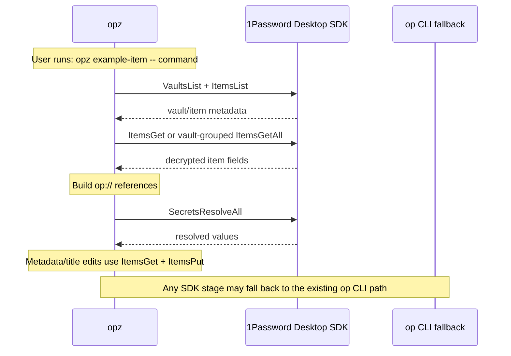

# opz
<!-- bdg:begin -->
[](https://crates.io/crates/opz)
[](https://github.com/opz-rs/opz)
[](https://github.com/opz-rs/opz/actions/workflows/ci.yaml)
<!-- bdg:end -->

`opz` is a small wrapper around the 1Password CLI. It finds items, turns valid field labels into environment variables, and runs commands with those secrets injected.

## Features

* Search 1Password items by title keyword.
* Check `op` authentication, optional CLI dependencies, and plaintext `.env`-style credential files with `doctor`.
* Show item field labels that are valid shell environment variable names.
* Manage 1Password Developer Environments through the 1Password MCP server without printing secret values.
* Add concealed placeholder variable names and inspect the MCP tools advertised by the installed server.
* Run a command with secrets from one or more 1Password items, with repository-title auto-detection.
* Apply integrity-pinned declarative launch plugins from the official `opz-plugin` registry.
* Delegate command execution to native 1Password Environments with `--environment` when your `op` CLI supports it.
* Generate env files containing `op://...` references, preserving unrelated existing lines.
* Migrate scripts from explicit items or `.env` files to repository metadata.
* Save private config files as Secure Notes.
* Store valid item fields as GitHub repository secrets, guarded by item repository metadata when present.
* Import Cloudflare API tokens, Worker secrets, and redacted API responses into 1Password.
* Store valid item fields as Cloudflare Worker secrets through Wrangler.
* Print the bundled `opz` Agent Skill.
* Cache item lists and repository metadata for fuzzy lookup and legacy migration paths.

## Installation

Prebuilt binaries via [`cargo binstall`](https://github.com/cargo-bins/cargo-binstall):

```bash
cargo binstall opz
```

Or build from source:

```bash
cargo install opz
```

## Usage

### Find Items

Search item titles by keyword:

```bash
opz find <query>
```

Example:
```bash
opz find github
# Output: <item-id>    <vault-name>    github-token
```

### Doctor

Check 1Password CLI status and external command dependencies:

```bash
opz doctor
```

`doctor` exits non-zero when required `op` checks fail. Missing optional tools such as the 1Password MCP server, `gh`, `wrangler`, `git`, `sh`, or `secretlint` are reported as warnings. It also probes the 1Password Desktop SDK read path, checks for plaintext `.env`-style credential files, and, when `secretlint` is available, runs it against those files. If the Desktop SDK is unavailable, enable **Settings → Developer → Integrate with the 1Password SDKs → Integrate with other apps** in the 1Password desktop app.

### Show Item Labels

Show field labels that can be used as environment variable names:

```bash
opz show [OPTIONS] [--with-item] <ITEM>...
```

Options:
* `--vault <NAME>` - Vault name (optional, searches all vaults if omitted)
* `--with-item` - Show per-item headers

Examples:
```bash
# Label names only (one per line)
opz show foo bar

# Include item header sections
opz show --with-item foo bar
```

### Emit Agent Skill

Print the bundled Agent Skills `SKILL.md` for `opz`:

```bash
opz skills
```

This lets other agents and tools load the current `opz` usage context directly in the Agent Skills standard format.

### Manage 1Password Environments

Use the 1Password MCP server to create, rename, inspect, and mount Developer Environments. If `--account <ACCOUNT_ID>` is omitted, `opz` authenticates through the 1Password app via MCP.

```bash
opz environment list
opz environment create dev
opz environment rename dev staging
opz environment variables dev
opz environment add dev API_TOKEN DB_URL
opz environment mount dev .env.local
opz environment mounts dev
opz environment tools

# Short alias
opz env list
```

`opz environment variables` prints variable names only. `opz environment add` creates empty, concealed placeholders, so secret values never appear in argv or `opz` output. Fill the values in the 1Password app. `opz environment mount` asks the MCP server to create a synced local `.env` mount; `opz` does not write secret values itself. `opz environment tools` prints the tool names returned by MCP `tools/list` without authenticating to an account.

The official bundled executable is `1password-mcp`. `opz` also accepts the older `onepassword-mcp` name as a compatibility fallback. Set `OPZ_1PASSWORD_MCP_COMMAND` to use an explicit executable path and `OPZ_MCP_TIMEOUT_SECONDS` to change the 30-second MCP response timeout.

### Declarative Plugins

`opz` vendors a reviewed snapshot of the official `opz-plugin` registry. Plugin manifests are declarative data: they can select an allowed target, project explicitly allowlisted item fields, add validated arguments, and create contained temporary configuration files. They cannot contain scripts, installers, hooks, arbitrary subprocesses, or wildcard secret access.

```bash
opz plugin list
opz plugin show codex-openai@1.0.0
opz plugin run codex-openai@1.0.0 --item owner/repo -- codex
```

A plugin-backed item pins one immutable registry release:

```text
OPZ_PLUGIN_SCHEMA_VERSION=1
OPZ_PLUGIN=codex-openai
OPZ_PLUGIN_SOURCE=github:opz-rs/opz-plugin/plugins/codex-openai
OPZ_PLUGIN_VERSION=1.0.0
OPZ_PLUGIN_SHA256=89f1fd0e0ac35669a620a2ddce10230635ff432453930ee691858629bb2062ce
OPZ_PLUGIN_CONFIG=
OPENAI_API_KEY=<concealed field>
```

Normal `opz run` automatically applies the pin when exactly one selected item contains `OPZ_PLUGIN`. Plugin metadata is never projected to the child environment. The runtime rechecks the registry digest, manifest schema, source/version pin, target allowlist, config types, secret allowlist, generated path containment, and release lifecycle before resolving a secret. Revoked releases never run; deprecated releases require the explicit `--allow-deprecated` flag on `opz plugin run`.

`OPZ_PLUGIN_REGISTRY_DIR` may point to an explicit local checkout containing `registry.toml` and `plugins/.../plugin.toml`. Local entries still require exact SHA-256 verification and do not enable network fetching or executable plugin code.

### Removed `create` Command

`opz create` no longer creates items. It remains as a hidden compatibility shim so older scripts get a clear migration error instead of an unknown-command failure.

Use these commands instead:

```bash
# Create an API_CREDENTIAL item from .env and migrate supported scripts
opz migrate --new

# Store a non-.env private file as Secure Note item(s)
opz note app.conf
```

### Run Commands with Secrets

Run a command with secrets from one or more 1Password items:

```bash
opz run [OPTIONS] [--env-file <ENV>] [<ITEM>...] -- <COMMAND>...
opz [OPTIONS] [--env-file <ENV>] [<ITEM>...] -- <COMMAND>...
opz run --environment <ENV> -- <COMMAND>...
opz --environment <ENV> -- <COMMAND>...
```

Options:
* `--vault <NAME>` - Vault name (optional, searches all vaults if omitted)
* `--env-file <ENV>` - Output env file path. If omitted, no file is written.
* `--environment <ENV>` / `--environments <ENV>` - Use native 1Password Environments injection through `op run` instead of item lookup.

Arguments:
* `<ITEM>...` - Optional item titles to fetch secrets from. When omitted, `opz` auto-detects one item whose title exactly matches a current git remote repository name such as `owner/repo`.

When `--env-file` is set, the file remains after the command exits and contains `op://` references, not resolved values. Existing regular files are replaced safely while preserving permissions and unrelated content; symlinks and non-regular targets are rejected. New files use mode `0600` on Unix. If multiple items define the same key, later items win (`opz run foo bar ...` prefers values from `bar`).

Examples:
```bash
# Run with one item and no .env file generated
opz run example-item -- your-command

# Auto-detect item from git remote title
opz run -- your-command

# Run command with multiple items (later items win on duplicate keys)
opz run foo bar -- your-command

# Generate an env file only when another tool requires op:// references
opz run --env-file .env foo bar -- your-command

# Top-level shorthand also supports multiple items
opz --env-file .env.local foo bar -- your-command

# Let a trusted child read the environment directly
opz run my-service -- your-command

# Or deliver a value through stdin inside an explicitly trusted child shell
opz run my-service -- sh -c 'printf "%s" "$API_TOKEN" | trusted-consumer --token-stdin'

# Specify vault
opz run --vault Private foo bar -- your-command

# Use a 1Password Environment without resolving values in opz
opz run --environment dev -- your-command
```

Environment mode is mutually exclusive with item arguments and `--env-file` in v1. `opz` delegates to `op run` and does not read Environment secret values. If your installed `op` CLI does not expose Environment runtime injection, `opz` reports a clear error and the item-backed workflow remains available.

`opz` passes command arguments unchanged and never substitutes resolved values for `$VAR` or `${VAR}` in argv. The child receives values only in its environment and is an explicit trust boundary. See [Secret-handling security policy](docs/security.md).

### Generate Env File

Generate `op://...` env references without running a command:

```bash
opz gen [OPTIONS] [--env-file <ENV>] <ITEM>...
```

Examples:
```bash
# Output sectioned env references to stdout
opz gen foo bar

# Generate .env file
opz gen --env-file .env foo bar

# Generate to custom path
opz gen --env-file .env.production foo bar

# Specify vault
opz --vault Private gen foo bar
```

Stdout uses per-item comment headers such as `# --- item: <title> ---`. File output writes the merged key list without those section comments.

### Migrate Scripts and `.env`

Migrate `justfile`/`Justfile` recipes and `package.json` scripts to repository item titles and metadata:

```bash
opz migrate [OPTIONS]
```

Options:
* `--dry-run` - Print metadata and file changes without editing 1Password items or files.
* `--new` - Create a new API_CREDENTIAL item from `.env` before rewriting `.env`-based scripts. The item title defaults to the first git remote repository name.
* `--restore` - Restore explicit item arguments in scripts that currently use itemless `opz run --`.
* `--vault <NAME>` - Vault name (optional, searches all vaults if omitted)

Behavior:
* `opz run <ITEM> -- <COMMAND>` and `opz <ITEM> -- <COMMAND>` stay explicit by default. `migrate` records repository metadata and, when there is exactly one item and one repository, renames the item and matching Just item variable to `owner/repo`.
* `opz migrate --restore` changes itemless `opz run -- <COMMAND>` back to explicit `opz run <ITEM> -- <COMMAND>` where the item can be inferred from a Just recipe parameter or the current repository title.
* `op item get <ITEM>` is used as a metadata registration signal, but is not rewritten because it is not equivalent to `opz run`.
* `.env`-based scripts are rewritten only with `--new`; without it, they are reported and skipped.
* `--dry-run` reports the repository metadata that would be ensured without fetching full item details.
* `package.json` is patched at the matching script string, so key order and formatting outside the changed value stay intact.

Examples:
```bash
# Preview migration
opz migrate --dry-run

# Rewrite scripts and update item metadata
opz migrate

# Create a new item from .env and migrate .env-based scripts
opz migrate --new

# Restore scripts that were previously migrated to itemless auto-detection
opz migrate --restore
```

### Save Private Config as Secure Note

Store a private config file as Secure Note item(s), titled from git remotes:

```bash
opz note <FILE>
```

Behavior:
* Stores the file as a fenced note body: ```` ```<file name>\n<content>\n``` ````.
* Uses git remote repository names (`org/repo`) as item titles.
* If multiple remotes exist, creates one item per remote; duplicate titles get `-2`, `-3`, and so on.
* Fails if no parseable git remote is available.

Examples:
```bash
opz note app.conf
opz --vault Private note app.conf
```

### Add GitHub Repository Metadata to Existing Items

Add or update `github_repositories` metadata on existing 1Password items:

```bash
opz github-repo [OPTIONS] <ITEM>...
```

Options:
* `--repo <OWNER/REPO>` - Repository to record. Repeat for multiple repositories. Defaults to parseable git remotes from the current repository.
* `--dry-run` - Print the metadata update without editing items.
* `--vault <NAME>` - Vault name (optional, searches all vaults if omitted)

Examples:
```bash
# Preview migration using current git remotes
opz github-repo --dry-run my-service shared-secrets

# Add current git remote repository metadata
opz github-repo my-service shared-secrets

# Add explicit repositories
opz github-repo --repo owner/repo --repo other/service my-service
```

Existing `github_repositories` entries are preserved and merged with the requested repositories.

### Store GitHub Repository Secrets

Store valid item fields as GitHub repository secrets:

```bash
opz github-secret [OPTIONS] <ITEM>...
```

Options:
* `--repo <OWNER/REPO>` - Target GitHub repository (defaults to the current `gh` repository)
* `--dry-run` - Print the secret names that would be set without writing values
* `--vault <NAME>` - Vault name (optional, searches all vaults if omitted)

Examples:
```bash
# Preview secret names
opz github-secret --dry-run my-service

# Store secrets in the current repository
opz github-secret my-service

# Store secrets in a specific repository
opz github-secret --repo owner/repo my-service shared-secrets
```

`github-secret` uses the same valid field labels as `gen` and `run`. Duplicate names across multiple items use the later item. Secret values are resolved in memory and passed to `gh secret set` through stdin; values are not printed or passed as command arguments. Names starting with `GITHUB_` are rejected because GitHub reserves that prefix.

If a selected 1Password item has a `github_repositories` field, the target repository must match one of its `owner/repo` entries before `opz` resolves or writes secret values. Multiple repositories are allowed by separating entries with newlines or commas. Items without this metadata are still allowed, but `opz` prints a warning because the repository guard cannot be applied.

### Import Cloudflare Credentials and API Responses

Import Cloudflare data into an exact-title 1Password item without putting secret values in argv, config files, or logs:

```bash
opz cloudflare-credential --preset <PRESET> --item <ITEM> [OPTIONS] --stdin
opz cloudflare-credential --preset <PRESET> --item <ITEM> [OPTIONS] --file <JSON>
opz cloudflare-credential --preset <PRESET> --item <ITEM> [OPTIONS] -- <COMMAND>...
```

Presets:
* `api-token` - Store one concealed API token. Defaults to section `Cloudflare` and field `CLOUDFLARE_API_TOKEN`.
* `worker-secret` - Store one secret, or map a JSON object's top-level keys to concealed fields. Defaults to section `Worker Secrets`.
* `api-response` - Store a JSON response as a concealed field. `Authorization`, `Cookie`, and token/secret/key-like fields are recursively replaced with `[REDACTED]` by default.

Options:
* `--mode <create|update|upsert>` - Select item creation behavior; default is `upsert`.
* `--vault <NAME>` - Limit exact item lookup and writes to a vault.
* `--section <SECTION>` / `--field <FIELD>` - Override preset destination labels.
* `--raw` - Disable API-response redaction. It is rejected for other presets and should be used only when the unredacted response must be retained.
* `--dry-run` - Parse and validate input, resolve whether the item would be created or updated, and print only destination references.

Examples:
```bash
# API token from stdin
printf '%s' "$CLOUDFLARE_API_TOKEN" |   opz cloudflare-credential --preset api-token --item cloudflare-prod --stdin

# Multiple Worker secrets from a JSON file
opz cloudflare-credential --preset worker-secret --item worker-prod   --section production --file worker-secrets.json

# Capture and redact a Cloudflare API command response before storage
opz cloudflare-credential --preset api-response --item cloudflare-audit   --field zones -- cloudflare-client zones list --json
```

Create and edit operations send a complete 1Password JSON item template through `op item create` or `op item edit` stdin. Stored fields use the concealed type. Successful writes print `op://<vault_id>/<item_id>/<section_id>/<field_id>` references and never echo imported values. Failed input commands suppress stderr because it may contain credentials. Input is limited to 16 MiB.

### Store Cloudflare Worker Secrets

Store valid item fields as Cloudflare Worker secrets through Wrangler:

```bash
opz cloudflare-secret [OPTIONS] <ITEM>...
```

Options:
* `--name <WORKER>` - Worker name passed to `wrangler secret bulk --name`
* `--env <ENV>` - Wrangler environment passed to `wrangler secret bulk --env`
* `--config <PATH>` - Wrangler config path passed to `wrangler secret bulk --config`
* `--dry-run` - Print the secret names that would be set without writing values
* `--vault <NAME>` - Vault name (optional, searches all vaults if omitted)

Examples:
```bash
# Preview secret names
opz cloudflare-secret --dry-run my-service

# Store secrets using the current Wrangler project config
opz cloudflare-secret my-service

# Store secrets for a specific Worker environment
opz cloudflare-secret --name worker-app --env production my-service shared-secrets
```

`cloudflare-secret` uses the same valid field labels as `gen` and `run`. Duplicate names across multiple items use the later item. Secret values are resolved in memory and passed to `wrangler secret bulk` through stdin as JSON; values are not printed or passed as command arguments.

## How It Works

1. When the Desktop SDK is available, `opz` lists vaults and item metadata through `VaultsList` + `ItemsList`; one exact-title item is fetched with `ItemsGet`, while multiple exact-title items are grouped by vault and fetched with `ItemsGetAll` in batches of up to 100. The official `op` CLI remains the fallback.
2. Item-list metadata is cached for 60 seconds and reused for exact-title lookup, title-contains fuzzy matching, and item-ID-to-vault resolution.
3. When item titles are omitted, `opz` reads git remotes and tries exact item titles such as `owner/repo`. The legacy `github_repositories` scan is only used when `OPZ_AUTODETECT_LEGACY_SCAN=1`; it uses the same vault-batched Desktop SDK item reads.
4. SDK item fields are adapted from the SDK schema (`title`/`value`) to the CLI-compatible internal model (`label`/`value`), then `opz` builds `op://<vault_id>/<item_id>/<field>` references for valid env labels.
5. If `--env-file` is set, `opz` writes references to that file and preserves unrelated existing lines. The usual path is file-free `opz run`; env files are for tools that require `op://` references.
6. Secret values are resolved in one batch through `onepassword-sdk-unofficial` and 1Password Desktop App authorization when a single account can be selected (`OP_ACCOUNT` takes precedence). If the desktop SDK is unavailable, `opz` falls back to `op run --env-file <temp> -- sh -c 'env -0'`, then to `op read` per reference for non-timeout failures. Set `OPZ_ONEPASSWORD_SDK=off` to disable all unofficial SDK paths.
7. Existing-item metadata updates used by `github-repo` and migration rename prefer `ItemsGet` + `ItemsPut`, mutating only the target field/title in the raw SDK item; SDK failures fall back to the existing `op item edit` path.
8. Item creation prefers `ItemsCreate` only when `--vault` resolves to exactly one SDK vault. Preflight failures safely fall back to `op item create`; after an SDK create request is submitted, failures are fail-closed rather than retried through the CLI because the mutation may already have succeeded and retrying could create a duplicate. Vault-default creation still uses the CLI.
9. `cloudflare-credential` uses SDK-native `ApiCredentials` sections and concealed fields for create/update when the SDK preflight succeeds. Create requires an explicit vault; update reuses the resolved item/vault IDs. Both mutations fail closed after submission, while preflight/shape failures retain the existing CLI path.
10. `opz` runs the command with resolved values in its environment and passes argv unchanged. Any shell expansion happens only inside a shell the user explicitly launches as the trusted child.

`gen` stops after writing references. `show` fetches items and prints valid labels without resolving secret values.

The desktop SDK batches all references from a command into a single `resolve_all` call (up to the SDK limit of 100 references). `op` fallback calls time out after 30 seconds by default. Set `OPZ_OP_TIMEOUT_SECONDS=<seconds>` to allow slower 1Password CLI operations. If CLI batch resolution times out, `opz` stops immediately instead of retrying once per secret.

Desktop SDK calls run inside an isolated, persistent `opz` child process so a blocked Desktop SDK authorization/IPC call cannot hang the parent indefinitely. The parent kills the bridge after 10 seconds by default, disables SDK use for the rest of that invocation, and falls back to the existing `op` CLI path; set `OPZ_SDK_TIMEOUT_SECONDS=<seconds>` to tune this boundary. Authorization, platform support, ambiguous vault selection, malformed/incomplete SDK responses, and other SDK failures use the same fallback. When an SDK attempt fails before a safe CLI fallback, `opz` writes one diagnostic hint to stderr per invocation; it never includes raw SDK failure details. If `OP_ACCOUNT` is unset, `opz` uses `op account list` only to select the account when exactly one account is configured, and caches that successful selection for the rest of the process so repeated SDK stages do not respawn the CLI.

## 1Password Read Path

For security transparency, here is the preferred Desktop SDK path and its CLI fallback:



Security: `opz` delegates secret access and authentication to the 1Password Desktop SDK when available and otherwise to the official `op` CLI. SDK item updates preserve the complete fetched item and change only the requested metadata field/title before `ItemsPut`; no item payloads are logged. The 60-second caches store item-list and repository metadata only, never secret values.

## Requirements

For the Desktop SDK fast path, sign in to the 1Password desktop app and enable **Settings → Developer → Integrate with the 1Password SDKs → Integrate with other apps**. Run `opz doctor` to verify the read path. Set `OP_ACCOUNT` to avoid CLI-based account discovery entirely. Otherwise `opz` can use `op account list` when exactly one CLI account is configured. Install and authenticate [1Password CLI](https://developer.1password.com/docs/cli/) (`op`) for fallback paths and CLI-backed write operations.

`github-secret` needs GitHub CLI (`gh`). `cloudflare-secret` needs Wrangler (`wrangler`). `migrate` and `note` need Git (`git`) when they read repository remotes.

`opz environment` uses the official `1password-mcp` executable bundled with supported 1Password desktop builds. Enable the local MCP server in **Settings > Labs > MCP Server** and **Settings > Developer > Integrate with MCP clients**. Set `OPZ_1PASSWORD_MCP_COMMAND` only when an explicit executable path is required.

## 1Password Environments and MCP

`opz` complements 1Password Environments instead of replacing them. Use `opz environment` through the 1Password MCP server to create Environments, inspect or add placeholder variable names, inspect server tools, and mount local `.env` files without exposing secret values to the agent. Use `opz run --environment <ENV> -- <COMMAND>` as repo-local command glue when native `op run` Environment injection is available. Keep item-backed `opz run`, `migrate`, `github-secret`, and `cloudflare-secret` for existing vault item workflows, repository-title auto-detection, and deploy secret sync.

## E2E Test

Real 1Password e2e test is available in `tests/e2e_real_op.rs`.

It is gated for safety and runs only when `OPZ_E2E=1` is set:

```bash
OPZ_E2E=1 cargo test --locked --test e2e_real_op -- --nocapture
```

Or use just:

```bash
just e2e
```

## Development

Contributor contracts and maintenance procedures are kept in
[AGENTS.md](AGENTS.md), with focused references for
[architecture](docs/architecture.md), [security](docs/security.md),
[compatibility](docs/compatibility.md), [toolchains](docs/toolchain.md), and
[releases](docs/releasing.md).
